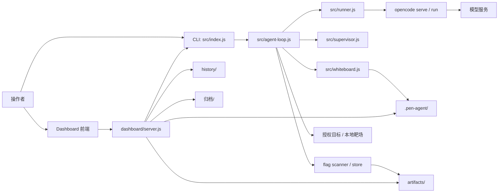

# AegisFlow

[](https://nodejs.org/)
[](https://vuejs.org/)
[](https://opencode.ai/)
[](LICENSE)
[](#安全与授权边界)

AegisFlow 是一个面向授权 CTF、内网靶场、安全教学和演示复盘的 agent 编排与可视化平台。它用 `opencode run` 执行分轮安全任务，把过程中的资产、服务、凭据、flag、证据、日志、笔记和下一步判断沉淀为结构化状态，再通过 Dashboard 展示出来。

> 本项目只用于明确授权的本地靶场、自有系统或内部演练。不要把它用于任何未授权目标、第三方系统或授权边界不清晰的环境。

## 目录

- [当前结构](#当前结构)
- [核心能力](#核心能力)
- [运行链路](#运行链路)
- [快速启动](#快速启动)
- [配置说明](#配置说明)
- [CLI 用法](#cli-用法)
- [Dashboard](#dashboard)
- [本地 Docker 靶场](#本地-docker-靶场)
- [历史数据与演示快照](#历史数据与演示快照)
- [测试与验证](#测试与验证)
- [项目结构](#项目结构)
- [开发约定](#开发约定)
- [安全与授权边界](#安全与授权边界)
- [常见问题](#常见问题)
- [后续计划](#后续计划)
- [许可证](#许可证)

## 当前结构

当前仓库已经整理成四个主要部分：

| 部分 | 位置 | 说明 |
| --- | --- | --- |
| Agent 编排核心 | `src/` | CLI 入口、配置解析、轮次调度、opencode runner、supervisor、whiteboard、flag 扫描和漏洞方向建议。 |
| Dashboard 后端 | `dashboard/server.js`, `dashboard/server/` | 本地 API 服务，负责启动/停止/恢复任务、读取运行状态、管理历史快照和提供静态前端资源。 |
| Dashboard 前端 | `dashboard/web/` | Vue 3 + Pinia + Vite 前端，展示启动页、总览、拓扑、时间线、发现、证据、flags、笔记、决策和协同状态。 |
| 本地 Docker 靶场 | `docker/local-goad-topology/` | 唯一维护的 Docker 靶场，模拟 DMZ、Office / Ops、Core Services 三段 Linux 企业网络。 |

需要特别说明两点：

- 当前只有一个 Docker 靶场：`docker/local-goad-topology/`。其中 `mock-goad/` 只是该靶场目录里的辅助/遗留材料，并没有在 `docker-compose.yml` 里作为第二套靶场启动。
- 当前只有一张静态靶场拓扑图：`docker/local-goad-topology/assets/topology.png`。Dashboard 里的“拓扑”页面是运行时根据 agent 发现生成的资产图，不是第二套靶场拓扑。

## 核心能力

- 轮次化 agent 执行：每一轮有目标、输出、结构化发现和停止条件。
- `opencode run` 集成：模型和 provider 通过 `.env`、CLI 或 Dashboard 配置。
- 实时 flag 扫描：输出流里出现的 flag 会写入 `artifacts/flags.json` 和 `artifacts/flags.txt`。
- 结构化复盘：supervisor 和 whiteboard 会整理 hosts、services、credentials、access、intel、risks 和 next steps。
- Dashboard 可视化：把实时运行和历史快照统一展示，便于演示、答辩和继续开发。
- 历史快照：每次从 Dashboard 启动/停止/恢复任务时，会归档当前状态，支持回放。
- 本地靶场：提供一个可控的 Docker Linux 企业网络，用于授权实验和演示。

## 运行链路



典型流程：

1. 配置 `.env`，准备 provider、model、API key 和 `opencode` 地址。
2. 启动 `opencode serve`。
3. 从 Dashboard 或 CLI 启动任务。
4. `src/index.js` 初始化 `.pen-agent/` 和 `artifacts/`。
5. `src/agent-loop.js` 按轮次调用 `src/runner.js`。
6. `src/runner.js` 调用 `opencode run`，并把输出写入 stream log。
7. flag scanner 实时扫描输出，supervisor 提取结构化发现。
8. whiteboard 更新当前态，Dashboard 读取并展示。
9. Dashboard 启动新任务或任务结束时，把当前运行快照写入 `history/`。

## 快速启动

### 1. 安装依赖

```bash
npm install
npm --prefix dashboard/web install
```

### 2. 配置环境变量

```bash
cp .env.example .env
```

编辑项目根目录的 `.env`：

```dotenv
PEN_AGENT_API_KEY=<your-provider-api-key>
PEN_AGENT_PROVIDER=deepseek
PEN_AGENT_MODEL=deepseek/deepseek-v4-flash
PEN_AGENT_ATTACH_URL=http://localhost:4096
PEN_AGENT_AGENT=

DASHBOARD_HOST=127.0.0.1
DASHBOARD_PORT=3000
```

`.env` 已被 `.gitignore` 忽略，不要提交真实 key。

### 3. 启动 opencode

```bash
opencode serve --port 4096
```

也可以使用：

```bash
opencode web --hostname 0.0.0.0 --port 4096
```

### 4. 启动 Dashboard

开发模式需要两个终端。

终端 1：

```bash
npm run dashboard:server
```

终端 2：

```bash
npm run dashboard:dev
```

打开：

```text
http://localhost:5173
```

生产构建后的本地模式：

```bash
npm run dashboard:build
npm run dashboard:server
```

打开：

```text
http://127.0.0.1:3000
```

### 5. 启动一次授权任务

从 Dashboard 启动：进入“启动”页，填写目标、scope、循环次数、flag 数、模型和 attach URL，然后点击启动。

从 CLI 启动：

```bash
node src/index.js -t <target-host> -p <target-port> --attach http://localhost:4096
```

示例：

```bash
node src/index.js \
  -t 127.0.0.1 \
  -p 18080 \
  --flags 1 \
  --min-loops 1 \
  --max-loops 8 \
  --stop-after-stale 2
```

查看当前状态：

```bash
npm run status
```

## 配置说明

配置优先级：

```text
CLI 参数 > shell 环境变量 > .env > 项目默认值
```

| 变量 | 说明 | 默认值 |
| --- | --- | --- |
| `PEN_AGENT_API_KEY` | provider API key，用于写入 opencode auth。 | 空 |
| `PEN_AGENT_PROVIDER` | 写入 opencode auth 的 provider 名称。 | `deepseek` |
| `PEN_AGENT_MODEL` | CLI 和 Dashboard 默认模型。 | `deepseek/deepseek-v4-flash` |
| `PEN_AGENT_ATTACH_URL` | opencode 后端地址。 | `http://localhost:4096` |
| `PEN_AGENT_AGENT` | 可选的 opencode agent 名称。 | 空 |
| `DASHBOARD_HOST` | Dashboard API 监听地址。 | `127.0.0.1` |
| `DASHBOARD_PORT` | Dashboard API 监听端口。 | `3000` |

Dashboard 的 `/api/config` 只返回非敏感配置：

```json
{
  "model": "deepseek/deepseek-v4-flash",
  "agent": "",
  "attachUrl": "http://localhost:4096",
  "provider": "deepseek",
  "hasApiKey": true
}
```

真实 API key 不会返回给前端。

## CLI 用法

```bash
node src/index.js [options]
```

| 参数 | 说明 | 默认值 |
| --- | --- | --- |
| `-t, --target <host>` | 目标主机或域名。 | `127.0.0.1` |
| `-p, --port <port>` | 目标端口。 | `80` |
| `-f, --flags <n>` | 最低期望 flag 数。 | `1` |
| `--max-flags <n>` | 预估最大 flag 数。 | 不限制 |
| `-m, --model <model>` | opencode 模型。 | `.env` 或项目默认值 |
| `-a, --agent <agent>` | 指定 opencode agent。 | 空 |
| `-k, --key <key>` | 写入 opencode auth 的 API key。 | 空 |
| `--provider <name>` | provider 名称。 | `.env` 或 `deepseek` |
| `--attach <url>` | opencode 后端地址。 | `.env` 或默认值 |
| `--max-loops <n>` | 最大轮次数。 | `50` |
| `--min-loops <n>` | 允许停滞停止前至少执行的轮次数。 | `3` |
| `--stop-after-stale <n>` | 连续多少轮没有新发现后停止。 | `2` |
| `--proxy-port <port>` | 本地代理服务端口。 | `9999` |
| `--scope <mode>` | 公网边界策略：`entry-port`、`public-host`、`open`。 | `entry-port` |
| `--no-private-pivot` | 禁止入口打通后的私网横向。 | 允许 |
| `--artifact-dir <path>` | 运行产物目录。 | `./artifacts` |
| `--pattern <regex>` | 自定义 flag 正则。 | 常见 flag 格式 |
| `--resume` | 在当前状态基础上继续任务。 | 关闭 |
| `--no-auto` | 关闭自动批准。 | 开启 |
| `--status` | 查看当前 runner 状态。 | 关闭 |

## Dashboard

Dashboard 后端由 `dashboard/server.js` 作为入口，辅助模块在 `dashboard/server/`：

| 文件 | 作用 |
| --- | --- |
| `dashboard/server.js` | HTTP API、任务启动/停止/恢复、运行历史归档、静态资源服务。 |
| `dashboard/server/archives.js` | 实时数据、`history/` 历史运行和 `归档/` 旧演示快照的数据源选择。 |
| `dashboard/server/fs-utils.js` | JSON 和文件读取工具。 |
| `dashboard/server/http.js` | JSON 响应、请求 body、静态文件处理。 |
| `dashboard/server/path-utils.js` | 历史运行 ID 和路径安全校验。 |

Dashboard 前端在 `dashboard/web/`，主要页面由 `dashboard/web/src/App.vue` 和 `dashboard/web/src/pages/` 组织。

| 页面 | 内容 |
| --- | --- |
| 启动 | 配置目标、scope、循环次数、flag 数、模型和 attach URL。 |
| 总览 | 当前状态、flag 统计、最近动作、阻塞风险和原始日志。 |
| 拓扑 | 根据 agent 发现的主机、服务、凭据和访问路径生成运行时资产关系图。 |
| 时间线 | 按轮次展示 agent 执行摘要。 |
| 发现 | 汇总 hosts、services、credentials、access 和 intel。 |
| 证据 | 展示每轮调用的工具、命令、目的和影响。 |
| Flags | 展示已发现 flag、来源、方法和证据。 |
| 笔记 | 读取 `artifacts/notes/` 下的 Markdown 笔记。 |
| 决策 | 展示下一步建议、问题、修正和奖励判断。 |
| 协同 | 根据 whiteboard 推导阶段交接和协同状态。 |

Dashboard 的实时数据来源：

```text
.pen-agent/state.json
.pen-agent/status.json
.pen-agent/stream.log
artifacts/flags.json
artifacts/flags.txt
artifacts/notes/
```

## 本地 Docker 靶场

本项目当前只维护一个本地 Docker 靶场：

```text
docker/local-goad-topology/
```

它模拟一个 Linux 企业网络环境，包含 DMZ、Office / Ops、Core Services 三个网段，以及 ThinkPHP 入口节点、SSH 跳板、内网门户、Struts、Gogs、Mailpit、OpenLDAP、MariaDB、Redis、Samba、MinIO、CoreDNS 和若干 flag 文件。

快速启动：

```bash
cd docker/local-goad-topology
docker compose up -d --build
```

主要入口：

| 入口 | 地址 | 说明 |
| --- | --- | --- |
| DMZ Web | `http://127.0.0.1:18080/` | ThinkPHP 入口站点。 |
| SSH 跳板 | `ssh jumpop@127.0.0.1 -p 2222` | 进入 `jump01`，密码 `JumpPass123!`。 |
| 内网工作站 | `docker exec -it lab-dev01 sh` | 进入 `dev01` 后可访问 Office/Core 服务。 |

分区摘要：

| 区域 | CIDR | 代表节点 |
| --- | --- | --- |
| DMZ | `10.80.10.0/24` | `thinkphp`, `jump01` |
| Office / Ops | `10.80.20.0/24` | `intranet`, `wiki01`, `git01`, `mail01`, `dev01` |
| Core Services | `10.80.30.0/24` | `ldap01`, `db01`, `cache01`, `files01`, `minio01`, `dns01` |

完整的靶机分布、路由关系、账号、flag 位置、SSH 隧道、验证命令和清理方式见 [docker/local-goad-topology/README.md](docker/local-goad-topology/README.md)。

静态靶场拓扑图只有一张，位置是 [docker/local-goad-topology/assets/topology.png](docker/local-goad-topology/assets/topology.png)。Dashboard 的“拓扑”页是运行时资产图，两者用途不同。

## 历史数据与演示快照

当前 Dashboard 有三类可读数据源：

| 数据源 | 位置 | 说明 |
| --- | --- | --- |
| 实时运行 | `.pen-agent/`, `artifacts/` | 当前任务状态和产物。 |
| 历史运行 | `history/` | Dashboard 启动/停止/恢复任务时自动归档的新运行快照，索引在 `history/runs.json`。 |
| 旧演示归档 | `归档/` | 兼容早期手工整理的演示快照，例如 `归档/history/demo-*`。 |

`history/` 和 `归档/` 都可能包含目标、日志、flag、路径和操作痕迹，默认不提交。

推荐的快照结构：

```text
history/<run-id>/
├── .pen-agent/
│   ├── state.json
│   ├── status.json
│   └── stream.log
└── artifacts/
    ├── flags.json
    ├── flags.txt
    └── notes/*.md
```

Dashboard 顶部的演示数据选择器会展示实时数据、`history/` 历史运行和 `归档/` 旧快照。选择快照后进入只读回放；启动真实任务时会自动切回实时数据。

## 测试与验证

语法检查：

```bash
npm run check
```

前端构建：

```bash
npm run dashboard:build
```

全量验证：

```bash
npm run verify
```

Dashboard API 验证：

```bash
npm run dashboard:server
curl http://127.0.0.1:3000/api/health
curl http://127.0.0.1:3000/api/config
curl http://127.0.0.1:3000/api/archives
curl http://127.0.0.1:3000/api/history
curl http://127.0.0.1:3000/api/flags
```

Docker 靶场验证见 [docker/local-goad-topology/README.md](docker/local-goad-topology/README.md) 的“验证环境”章节。

## 项目结构

```text
.
├── README.md
├── LICENSE
├── package.json
├── package-lock.json
├── .env.example
├── .gitignore
├── opencode.json
├── src/
│   ├── index.js
│   ├── config.js
│   ├── env-loader.js
│   ├── agent-loop.js
│   ├── runner.js
│   ├── supervisor.js
│   ├── whiteboard.js
│   ├── flag-counter.js
│   ├── flag-store.js
│   ├── stream-flag-scanner.js
│   ├── skill-router.js
│   └── vulnerability-playbooks.js
├── dashboard/
│   ├── server.js
│   ├── dev.js
│   ├── server/
│   └── web/
├── proxy/
│   ├── proxy-server.js
│   └── proxy-client.go
├── docker/
│   └── local-goad-topology/
├── history/                 # 自动历史运行快照，默认忽略
├── 归档/                    # 旧演示归档，默认忽略
├── .pen-agent/              # 当前运行状态，默认忽略
├── artifacts/               # 当前运行产物，默认忽略
├── output/                  # 截图和报告输出，默认忽略
└── test-results/            # 测试输出，默认忽略
```

## 开发约定

- 核心运行逻辑放在 `src/`。
- Dashboard 后端入口保留在 `dashboard/server.js`，可复用逻辑放进 `dashboard/server/`。
- Dashboard 前端页面放在 `dashboard/web/src/pages/`，通用组件放在 `dashboard/web/src/components/`。
- 运行数据写入 `.pen-agent/`、`artifacts/`、`history/` 或 `logs/`，不要提交。
- 旧演示快照放在 `归档/`，发布前确认不含敏感目标、私有 flag、真实路径或 API key。
- 改动启动方式、配置项、目录结构、靶场拓扑或数据源时，同步更新 README。
- 提交前运行 `npm run verify`。

## 安全与授权边界

允许使用的场景：

- 授权 CTF。
- 本地 Docker 靶场。
- 自有系统。
- 公司内部明确授权的安全演练。
- 教学、答辩、演示和回放。

禁止使用的场景：

- 未授权公网目标。
- 第三方系统。
- 授权范围不清晰的目标。
- 任何可能违反法律、合同或平台规则的环境。

操作建议：

- 启动前先明确目标、端口、scope 和停止条件。
- 演示时使用较小的 `--max-loops`。
- 需要私网横向时，只在授权靶场里打开相关能力。
- 复盘时优先看 Dashboard 的结构化数据，再检查原始日志。
- 发布仓库前确认 `.env`、`.pen-agent/`、`artifacts/`、`history/`、`logs/` 和 `归档/` 没有敏感信息。

## 常见问题

### 仓库里是不是有两个靶场？

不是。当前只有一个 Docker Compose 靶场：`docker/local-goad-topology/`。`docker/local-goad-topology/assets/topology.png` 是唯一静态靶场拓扑图。Dashboard 的“拓扑”页展示的是 agent 运行时发现的资产关系图，不是第二套靶场。

### Dashboard 显示 Key 未配置

确认项目根目录存在 `.env`，并且包含：

```dotenv
PEN_AGENT_API_KEY=<your-provider-api-key>
```

然后重启 `npm run dashboard:server`。

### 启动任务后没有输出

检查 `opencode` 是否已经启动：

```bash
opencode serve --port 4096
```

同时确认 `.env` 中的 `PEN_AGENT_ATTACH_URL` 和 CLI 的 `--attach` 指向同一个地址。

### Dashboard 页面打不开

开发模式访问：

```text
http://localhost:5173
```

生产构建后访问：

```text
http://127.0.0.1:3000
```

### 修改代码后怎么确认没坏

```bash
npm run verify
npm run status
```

### 发布前怎么确认运行文件不会被提交

```bash
git check-ignore -v node_modules output test-results .pen-agent artifacts history logs 归档 归档.zip
```

## 后续计划

- 增加 Dashboard 端到端 smoke test。
- 给 `.pen-agent/state.json`、`history/` 和旧归档快照增加更严格的 schema 校验。
- 优化运行时拓扑图布局和历史快照对比。
- 补充 Docker 靶场的一键启动和清理脚本。
- 增加发布前检查清单，减少敏感数据误提交风险。

## 许可证

本项目基于 [MIT License](LICENSE) 发布。
