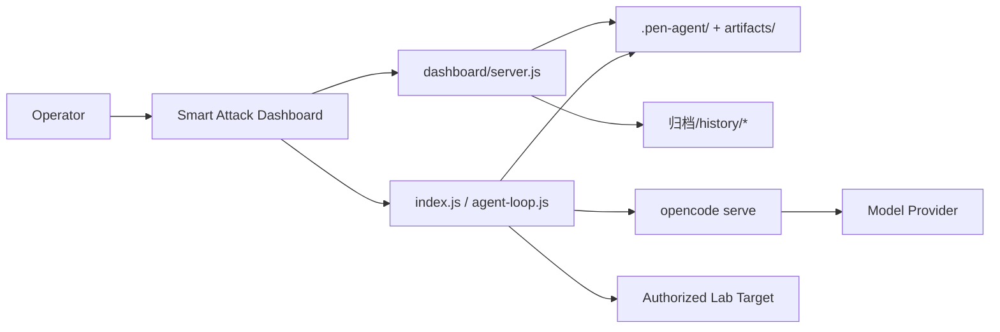

# Smart Attack Team Scheduling Lab

[](https://nodejs.org/)
[](https://vuejs.org/)
[](https://opencode.ai/)
[](LICENSE)
[](#security-and-ethics)

Smart Attack Team Scheduling Lab is an agent orchestration and visualization system for authorized CTF labs, cyber ranges, and internal security exercises.

The project combines a round-based `opencode` agent runner with a lightweight dashboard. The runner coordinates reconnaissance, validation, exploitation evidence, flags, notes, and handoff state. The dashboard turns those runtime artifacts into a clean operator view for demos, reviews, and continued development.

> This project is for authorized lab environments only. Do not use it against systems you do not own or do not have explicit permission to test.

## Table Of Contents

- [Why This Exists](#why-this-exists)
- [Preview](#preview)
- [Features](#features)
- [Architecture](#architecture)
- [Requirements](#requirements)
- [Quick Start](#quick-start)
- [Configuration](#configuration)
- [Dashboard](#dashboard)
- [Demo Archives](#demo-archives)
- [CLI Usage](#cli-usage)
- [Project Structure](#project-structure)
- [Development](#development)
- [Testing](#testing)
- [Security And Ethics](#security-and-ethics)
- [Roadmap](#roadmap)
- [Contributing](#contributing)
- [License](#license)

## Why This Exists

Most agent security demos either stop at a single exploit path or leave behind unstructured logs that are hard to review. This project is built around a different workflow:

- Keep the agent inside explicit task boundaries.
- Split work into auditable rounds.
- Preserve evidence, decisions, problems, and next steps.
- Make flags and artifacts visible without digging through raw logs.
- Support both live runs and replayable historical demo snapshots.

The current lab focus is a ThinkPHP target and a Smart Attack dashboard. Older Spring RCE lab work has been removed from the active path so the project can stay focused and easier to maintain.

## Preview

Dashboard overview:


## Features

- Round-based agent loop with clear stop points and handoff prompts.
- `opencode run` integration without hard-coding a model provider into the frontend.
- Local `.env` configuration for API keys, model, provider, and attach URL.
- Real-time dashboard for status, topology, timeline, findings, evidence, flags, notes, decisions, and team handoff.
- Historical archive selector for rehearsable demos under `归档/history/`.
- Structured state in `.pen-agent/state.json` and normalized flag files in `artifacts/`.
- Lightweight internal proxy utilities for explicitly authorized lab scenarios.
- Safety-oriented defaults: secrets are ignored, dashboard does not expose API keys, and runtime artifacts are kept out of source control.

## Architecture



Runtime flow:

1. The operator configures `.env` and starts `opencode`.
2. The dashboard reads non-secret runtime defaults from `/api/config`.
3. A task starts through the dashboard or CLI.
4. `index.js` initializes runtime directories and launches the round loop.
5. `runner.js` invokes `opencode run`.
6. `supervisor.js`, `whiteboard.js`, and flag helpers update structured state.
7. The dashboard reads current state or a selected archive snapshot.

## Requirements

- Node.js 18 or newer.
- npm.
- `opencode` installed and available in `PATH`.
- A model provider API key, unless `opencode` is already authenticated.
- An authorized lab target. Do not point this project at public third-party systems.

## Quick Start

### 1. Install dependencies

```bash
npm install
npm --prefix dashboard/web install
```

### 2. Configure secrets

Copy the local environment template:

```bash
cp .env.example .env
```

Edit `.env` in the project root:

```dotenv
PEN_AGENT_API_KEY=<your-provider-api-key>
PEN_AGENT_PROVIDER=deepseek
PEN_AGENT_MODEL=deepseek/deepseek-v4-flash
PEN_AGENT_ATTACH_URL=http://localhost:4096
PEN_AGENT_AGENT=

DASHBOARD_HOST=127.0.0.1
DASHBOARD_PORT=3000
```

Never commit `.env`. It is ignored by `.gitignore`.

### 3. Start opencode

```bash
opencode serve --port 4096
```

You can also use the opencode web server:

```bash
opencode web --hostname 0.0.0.0 --port 4096
```

### 4. Start the dashboard

Development mode uses two terminals:

```bash
npm run dashboard:server
```

```bash
npm run dashboard:dev
```

Open:

```text
http://localhost:5173
```

Production-style local mode:

```bash
npm run dashboard:build
npm run dashboard:server
```

Open:

```text
http://127.0.0.1:3000
```

### 5. Run an authorized task

From the dashboard, use the start page and confirm the target, loops, and flag expectations.

From the CLI:

```bash
node index.js -t <target-host> -p <target-port> --attach http://localhost:4096
```

Example for a private lab hostname:

```bash
node index.js \
  -t thinkphp.lab.local \
  -p 80 \
  --min-loops 1 \
  --max-loops 8 \
  --stop-after-stale 2
```

## Configuration

The recommended configuration path is the root `.env` file.

| Variable | Description | Default |
| --- | --- | --- |
| `PEN_AGENT_API_KEY` | Provider API key used when opencode auth is not already configured. | empty |
| `PEN_AGENT_PROVIDER` | Provider name written to opencode auth. | `deepseek` |
| `PEN_AGENT_MODEL` | Default model used by CLI and dashboard. | `deepseek/deepseek-v4-flash` |
| `PEN_AGENT_ATTACH_URL` | opencode backend URL. | `http://localhost:4096` |
| `PEN_AGENT_AGENT` | Optional named opencode agent. | empty |
| `DASHBOARD_HOST` | Dashboard API host. | `127.0.0.1` |
| `DASHBOARD_PORT` | Dashboard API port. | `3000` |

Configuration precedence:

```text
CLI arguments > shell environment > .env > project defaults
```

The dashboard only exposes non-secret configuration:

```json
{
  "model": "deepseek/deepseek-v4-flash",
  "attachUrl": "http://localhost:4096",
  "provider": "deepseek",
  "hasApiKey": true
}
```

The real API key is never returned to the frontend.

## Dashboard

The dashboard reads live runtime data from:

- `.pen-agent/state.json`
- `.pen-agent/status.json`
- `.pen-agent/stream.log`
- `artifacts/flags.json`
- `artifacts/flags.txt`
- `artifacts/notes/`

Main views:

| View | Purpose |
| --- | --- |
| Start | Configure and launch a task. |
| Overview | Current status, key counters, recent actions, and logs. |
| Topology | Discovered assets and relationships. |
| Timeline | Round-by-round execution history. |
| Findings | Hosts, services, credentials, access, and tactical intelligence. |
| Evidence | Commands, tool calls, outputs, and evidence paths. |
| Flags | Flag inventory and best-effort attribution. |
| Notes | Operator notes from `artifacts/notes/`. |
| Decisions | Next steps, problems, corrections, and reward evaluation. |
| Team | Stage handoff and collaboration state. |

Dashboard implementation notes are kept in [dashboard/README.md](dashboard/README.md).

## Demo Archives

Historical demo data lives under:

```text
归档/history/
```

A snapshot can contain:

```text
归档/history/demo-name/
├── archive.json
├── .pen-agent/
│   ├── state.json
│   ├── status.json
│   └── stream.log
└── artifacts/
    ├── flags.json
    ├── flags.txt
    └── notes/*.md
```

The dashboard archive selector automatically discovers these snapshots. Selecting an archive switches the UI to read-only replay mode. Starting a real task switches the dashboard back to live data.

## CLI Usage

```bash
node index.js [options]
```

| Option | Description | Default |
| --- | --- | --- |
| `-t, --target <host>` | Target host or domain. | `127.0.0.1` |
| `-p, --port <port>` | Target port. | `80` |
| `-f, --flags <n>` | Minimum expected flag count. | `1` |
| `--max-flags <n>` | Estimated maximum flag count. | unlimited |
| `-m, --model <model>` | opencode model. | `.env` or project default |
| `-a, --agent <agent>` | Named opencode agent. | empty |
| `-k, --key <key>` | API key to write into opencode auth. | empty |
| `--provider <name>` | Provider name for opencode auth. | `.env` or `deepseek` |
| `--attach <url>` | opencode backend URL. | `.env` or `http://localhost:4096` |
| `--max-loops <n>` | Maximum loop count. | `50` |
| `--min-loops <n>` | Minimum loops before stopping is allowed. | `3` |
| `--stop-after-stale <n>` | Stop after this many rounds without new findings. | `2` |
| `--proxy-port <port>` | Local proxy service port. | `9999` |
| `--artifact-dir <path>` | Runtime artifact directory. | `./artifacts` |
| `--pattern <regex>` | Custom flag regex. | common flag formats |
| `--status` | Print current runner status. | off |

## Project Structure

```text
.
├── index.js                 # CLI entrypoint and runtime initialization
├── config.js                # .env, CLI argument parsing, defaults, validation
├── env-loader.js            # Small .env loader used by CLI and dashboard
├── agent-loop.js            # Round-based orchestration loop
├── runner.js                # opencode run wrapper and log streaming
├── supervisor.js            # Structured extraction from agent output
├── whiteboard.js            # Append-only state board
├── flag-counter.js          # Flag scanning and deduplication
├── flag-store.js            # Flag file persistence
├── skill-router.js          # Skill selection support
├── vulnerability-playbooks.js
├── proxy/                   # Authorized lab proxy utilities
├── dashboard/               # Node API and Vue dashboard
├── docker/local-goad-topology/
│   └── thinkphp/            # ThinkPHP lab target materials
├── 归档/history/            # Replayable demo snapshots
├── .pen-agent/              # Live state, ignored by git
├── artifacts/               # Live artifacts, ignored by git
└── logs/                    # Runtime logs, ignored by git
```

## Development

Useful scripts:

```bash
npm run check
npm run dashboard:build
npm run verify
npm run dashboard:server
npm run dashboard:dev
npm run status
```

Development conventions:

- Keep secrets in `.env`, never in source files.
- Keep runtime output inside `.pen-agent/`, `artifacts/`, or `logs/`.
- Add dashboard API helpers in `dashboard/web/src/services/api.ts`.
- Add dashboard pages in `dashboard/web/src/pages/`.
- Add reusable frontend pieces in `dashboard/web/src/components/`.
- Add demo snapshots as new directories under `归档/history/`.
- Keep route handlers in `dashboard/server.js` thin and move reusable logic into named helpers.

## Testing

Run all available checks:

```bash
npm run verify
```

This runs Node syntax checks and the Vue production build.

Check whether local API configuration is loaded:

```bash
node -e "import('./config.js').then(({config}) => console.log({ hasKey: Boolean(config.apiKey), model: config.opencodeModel, attach: config.attachUrl, provider: config.authProvider }))"
```

Start the dashboard API and check key endpoints:

```bash
npm run dashboard:server
```

```bash
curl http://127.0.0.1:3000/api/health
curl http://127.0.0.1:3000/api/config
curl http://127.0.0.1:3000/api/archives
curl -X POST http://127.0.0.1:3000/api/archives/select \
  -H 'Content-Type: application/json' \
  --data '{"id":"history/demo-03-full-chain"}'
curl http://127.0.0.1:3000/api/flags
```

Expected behavior:

- `/api/config` reports `hasApiKey`, but never returns the real API key.
- Archive selection changes the displayed data source.
- Starting a live task switches the dashboard back to live mode.
- Frontend build completes without type errors.

## Security And Ethics

Use this project only in:

- Authorized CTFs and cyber ranges.
- Internal systems you own.
- Environments where you have explicit written permission to test.
- Local development and replay demos.

Do not use it against third-party systems, public targets, or any environment where authorization is unclear.

Operational safety expectations:

- Define scope before starting a task.
- Use conservative loop counts for demos.
- Review generated commands and artifacts.
- Do not commit secrets, live logs, or target-specific confidential data.
- Treat proxy and pivoting utilities as lab-only features.

## Roadmap

- Stabilize ThinkPHP-focused demo data and remove stale lab references.
- Add stronger schema validation for runtime state and archive snapshots.
- Add end-to-end dashboard smoke tests.
- Improve topology layout controls and archive comparison.
- Add a release checklist for packaging public demos.

## Contributing

Contributions are welcome when they keep the project focused on authorized lab workflows.

Before opening a change:

1. Run `npm run verify`.
2. Keep secrets and runtime artifacts out of the patch.
3. Update README or `dashboard/README.md` when behavior changes.
4. Prefer small, reviewable changes over broad rewrites.
5. Include sample archive data only when it is sanitized and safe to publish.

## License

This project is released under the [MIT License](LICENSE).
