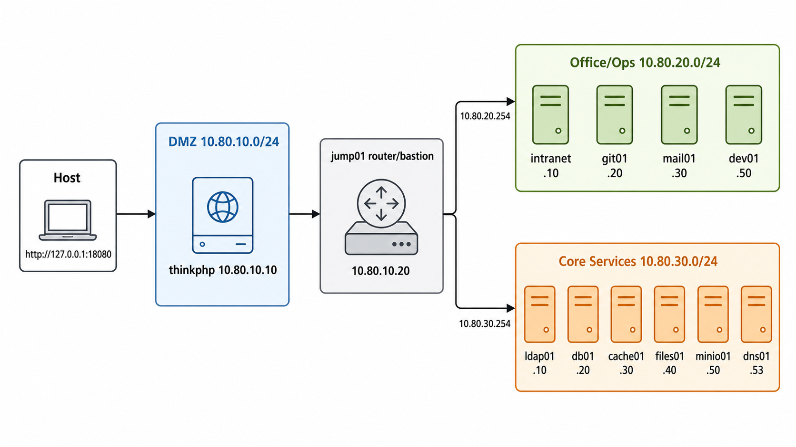

# Docker Linux Enterprise Lab

This is a Docker-based Linux enterprise network simulation. It does not try to
run GOAD or Windows Active Directory in containers. The goal is to keep the same
attack path shape while using real Linux services:

```text
host -> ThinkPHP entry in DMZ -> jump01 router/bastion -> office services -> core services
```

## Network Topology



| Zone          | CIDR              | Purpose                                     |
| ------------- | ----------------- | ------------------------------------------- |
| DMZ           | `10.80.10.0/24` | Externally exposed entry service            |
| Office / Ops  | `10.80.20.0/24` | Internal user and operations services       |
| Core Services | `10.80.30.0/24` | Directory, data, storage, and name services |

## Nodes

| Node         | Address                                             | Service                                                       |
| ------------ | --------------------------------------------------- | ------------------------------------------------------------- |
| `thinkphp` | `10.80.10.10` | DMZ ThinkPHP 5.0.12 entry, published at `http://127.0.0.1:18080/` |
| `jump01`   | `10.80.10.20`, `10.80.20.254`, `10.80.30.254` | Linux router and SSH bastion, published at `127.0.0.1:2222` |
| `intranet` | `10.80.20.10`                                     | Nginx internal portal                                         |
| `wiki01`   | `10.80.20.11`                                     | Apache Struts 2.3.30, `CVE-2017-5638`                        |
| `git01`    | `10.80.20.20`                                     | Gogs 0.11.66, `CVE-2018-18925`                               |
| `mail01`   | `10.80.20.30`                                     | Mailpit SMTP and mailbox UI                                   |
| `dev01`    | `10.80.20.50`                                     | Linux developer workstation with CLI tools                    |
| `ldap01`   | `10.80.30.10`                                     | OpenLDAP                                                      |
| `db01`     | `10.80.30.20`                                     | MariaDB with seeded sample data                               |
| `cache01`  | `10.80.30.30`                                     | Redis 5.0.7, `CVE-2022-0543`                                 |
| `files01`  | `10.80.30.40`                                     | Samba 4.6.3, `CVE-2017-7494`                                 |
| `minio01`  | `10.80.30.50`                                     | S3-compatible object storage                                  |
| `dns01`    | `10.80.30.53`                                     | CoreDNS zone for `corp.local`                               |

## Vulnerability Index

The lab intentionally includes obvious CVE-oriented services in the Office and
Core zones. See [VULNERABILITIES.md](VULNERABILITIES.md) for the current
vulnerability map and intended attack shape.

## Lab Credentials

These are synthetic local-lab credentials, not production secrets.

| Service             | Username                      | Password           |
| ------------------- | ----------------------------- | ------------------ |
| `jump01` SSH        | `jumpop`                      | `JumpPass123!`     |
| `dev01` SSH         | `analyst`                     | `Analyst123!`      |
| `git01` SSH root    | `root`                        | `GitRootPass123!`  |
| MariaDB root        | `root`                        | `RootPassw0rd!`    |
| MariaDB app         | `app_svc`                     | `AppSvcPass123!`   |
| Redis               | n/a                           | no password        |
| Samba `myshare`     | guest                         | no password        |
| OpenLDAP admin DN   | `cn=admin,dc=corp,dc=local`   | `AdminPassw0rd!`   |
| MinIO root          | `minioadmin`                  | `MinioAdmin123!`   |
## Run

```powershell
$env:DOCKER_CONFIG='C:\Users\13313\VirtualBox VMs\GOAD\.docker'
$env:DOCKER_HOST='npipe:////./pipe/dockerDesktopLinuxEngine'
cd 'C:\Users\13313\VirtualBox VMs\GOAD\docker\local-goad-topology'
docker compose up -d --build
```

## Access

Open the DMZ entry point in a browser:

```text
http://127.0.0.1:18080/
```

SSH into the jump host:

```powershell
ssh jumpop@127.0.0.1 -p 2222
```

Password:

```text
JumpPass123!
```

Enter the internal Linux workstation directly from Docker:

```powershell
$env:DOCKER_CONFIG='C:\Users\13313\VirtualBox VMs\GOAD\.docker'
$env:DOCKER_HOST='npipe:////./pipe/dockerDesktopLinuxEngine'
cd 'C:\Users\13313\VirtualBox VMs\GOAD\docker\local-goad-topology'
docker exec -it lab-dev01 sh
```

Useful commands inside `dev01`:

```sh
nmap -sT 10.80.30.0/24
curl http://10.80.20.10
curl http://10.80.20.11:8080
curl http://10.80.20.20:3000
mariadb -h 10.80.30.20 -uapp_svc -pAppSvcPass123! app_prod
redis-cli -h 10.80.30.30 ping
smbclient -L //10.80.30.40 -N -m SMB3
```

Use SSH tunnels if you want to browse internal web services from the host:

```powershell
ssh -N `
  -L 18081:10.80.20.10:80 `
  -L 18082:10.80.20.11:8080 `
  -L 13000:10.80.20.20:3000 `
  -L 18025:10.80.20.30:8025 `
  -L 19001:10.80.30.50:9001 `
  jumpop@127.0.0.1 -p 2222
```

Then open:

```text
http://127.0.0.1:18081  intranet
http://127.0.0.1:18082  Struts wiki01
http://127.0.0.1:13000  Gogs
http://127.0.0.1:18025  Mailpit
http://127.0.0.1:19001  MinIO Console
```

MinIO credentials:

```text
minioadmin / MinioAdmin123!
```


Service-level flag shortcuts for lab validation:

```text
files01 Samba share: //10.80.30.40/myshare/flag.txt
git01 Gogs HTTP:      http://10.80.20.20:3000/flag.txt
minio01 S3 object:   s3://flag/flag.txt
```
## Validate

```powershell
.\scripts\test.ps1
```

## Stop and Remove

```powershell
$env:DOCKER_CONFIG='C:\Users\13313\VirtualBox VMs\GOAD\.docker'
$env:DOCKER_HOST='npipe:////./pipe/dockerDesktopLinuxEngine'
cd 'C:\Users\13313\VirtualBox VMs\GOAD\docker\local-goad-topology'
docker compose down -v
```
